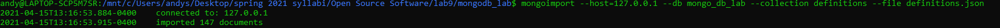

# Lab9

# Check 0 
The recent ruling on the Google vs Oracle hearing on the ability to copyright API's is a huge victory for open source software developers everywhere. Microsofts amicus brief encapsulates the benefits best, where they claim that by allowing API's to be copyrighted, it forces developers and users into proprietary standards, creating tons of compatibility headaches, and making it infinitely harder for software startups to be established. Needless to say, this is a huge win for software developers everywhere. Enabling, if not encouraging a common standard of API's across developers makes open source development much easier. 

# Check 1 

# Check 2 

NOTE: I have mongoDB 4.4, many of t he commands did not work and are out of date for this version. I was able to complete the lab, but was not able to get the exact outputs expected for this checkpoint. As proof that i did load in data I have taken screenshots of running the bash command and some data from the mongo shell. 

# Check 3 
![image] (3.1.PNG)

Git clone comparison, the green test was my altered change and the red text was the original (arrows indicating lines im refrencing) 
 

# Check 4
~~~

from pymongo import MongoClient
import pprint
client = MongoClient('localhost', 27017)

if __name__ == '__main__':
    db = client.mongo_db_lab
    definitions=db.definitions
    print("===== FINDING ALL RECORDS =====")
    for definition in definitions.find():
        pprint.pprint(definition)
    print("===== FINDING ONE RECORD =====")
    pprint.pprint(definitions.find_one())
    print("===== FINDING A SPECIFIC RECORD FOR THE WORD:BLOW OFF =====")
    pprint.pprint(definitions.find_one({"word":"Blow Off"}))

    print("===== INSERTING A NEW RECORD =====")
    newRecord={"definition":"A class about open source software","word":"OSS"}
    resultID =definitions.insert_one(newRecord).inserted_id
    print(resultID)
    print("==== FINDING A RECORD BY OBJECT ID =====")
    print("finding newly inserted record")
    pprint.pprint(definitions.find_one({"_id":resultID}))
~~~
NOTE: there's far too much output for finding and printing all records, if you want you can run the code yourself. 

# Check 5 

~~~
from pymongo import MongoClient
import pprint
import datetime
import random
client = MongoClient('localhost', 27017)

def getRandomWord(db,definitions):
    upperLimit=definitions.count_documents({})
    return definitions.find().limit(-1).skip(random.randint(0,upperLimit)).next()

def random_word_requester():
    db = client.mongo_db_lab
    definitions=db.definitions
    randomWord = getRandomWord(db,definitions)
    randomWordID=randomWord["_id"]
    currTime=datetime.datetime.isoformat(datetime.datetime.utcnow())
    print("=== RANDOM WORD AND DEFINITION ===")
    print("Word: {}\nDefinition: {}".format(randomWord["word"],randomWord["definition"]))
    if "dates" in randomWord and isinstance (randomWord["dates"],list) : 
        definitions.update_one({"_id": randomWordID},{"$push": {"dates": currTime }})
    else:
        definitions.find_one_and_update({"_id": randomWordID},{"$set": {"dates": [currTime] }})
    #definitions.update_one({"_id": str(randomWordID)},{"$push": randomWord})
    return definitions.find_one({"_id": randomWordID})

if __name__ == '__main__':
    pprint.pprint(random_word_requester())
~~~

